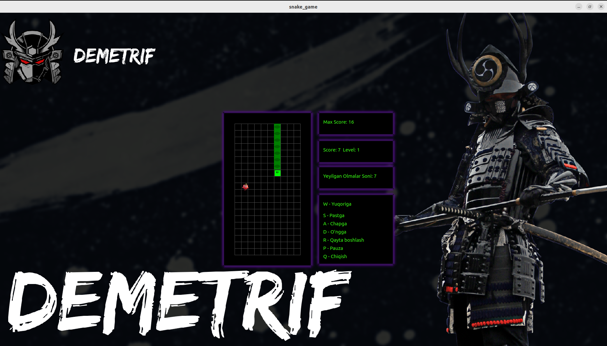

# Snake Game

**School 21 loyihasi** - *CPP3_BrickGame_v2.0* (Platformadagi nik: **Demetrif**)

Bu loyiha School 21 dagi **Snake Game** vazifasidir. Ilon o'yini oddiy va klassik o'yin bo'lib, o'yinchi ilonni boshqarib, ekran bo'ylab olma to'plashi kerak. O'yin davomida har bir olma ilonga qo'shimcha bo'laklar qo'shadi, ilon uzunligi oshib boradi va darajalar o'sib boradi. O'yin tugagandan so'ng, foydalanuvchi yuqori ballarni ko'rishi va o'yinni qayta boshlashi mumkin.

## O'yin interfeysi

O'yin interfeysining namunasi quyida ko'rsatilgan:



## O'yinni ishga tushirish

O'yinni ishga tushirish uchun quyidagi buyruqdan foydalanishingiz mumkin:

```bash
./run.sh
